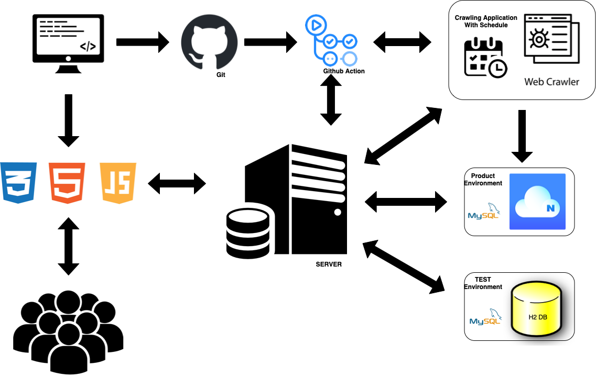

# 👕  JBLY
두 팀원 모두 의류 산업에 관심이 많아 평소 자주 사용하는 패션 플랫폼을 직접 한 번 만들어보고자 시작하게 되었습니다. 실제로 자주 이용하는 쇼핑몰에서 상품 데이터를 스크래핑한 후 화면에 사용자가 알아보기 쉽게 보여주는 서비스 입니다. 데이터 크롤링 시 발생할 수 있는 대용량 트래픽 이슈를 효율적으로 처리하는 것과, Data, Front-end, Back-end 세 분야를 다뤄보며 Web 전체에 대한 이해도를 높이고 이를 바탕으로 다른 분야 개발자와 협업 능력을 높이는 것이 목표입니다.

## 💡 문제 상황과 해결 방법
**1. 동적 크롤링을 하기 위해 Selenium을 사용한 결과 4078개의 데이터를 MySQL DB에 적재하는데 총 2시간 28분이 걸렸습니다.**

➡️ sleep과 같이 병목이 되는 코드는 전부 제거하고 Selenium 라이브러리를 사용하지 않고 스크래핑 하는 방식으로 리팩토링합니다. 

➡️ Python multiprocessing을 사용해 5개의 카테고리를 한 번에 스크래핑 하는 방식으로 리팩토링 합니다.

➡️ MySQL에 1만 개 이상의 데이터를 insert하기 위해 쿼리 성능을 튜닝합니다.

## ☑️ 요구사항
**1. 크롤링 기능**
  - 크롤링은 하루에 1번 주기적으로 일어나야하며, 크롤링 주기는 바뀔 수 있다.
  - 3개 이상의 쇼핑몰을 크롤링하여 해당 쇼핑몰의 데이터를 MySQL에 적재한다.

**2. JBLY 쇼핑몰 기능**
  - 사용자는 초기 화면에서 회원가입, 로그인을 할 수 있다.
  - 사용자는 카테고리별로 상품을 조회할 수 있다.
  - 상품을 클릭하면 상품의 상세 정보를 확인 할 수 있다.
  - 로그인한 사용자는 마이페이지 기능과 로그아웃 기능을 사용할 수 있다.

## ⚒️ Project Architecture

## 📖 사용 기술 및 개발 환경
Spring Boot, Java17, Gradle, Naver Cloud, H2, MySQL, HTML, CSS, JS, JPA, Python, BeautifulSoup, GithubAction Cron Scheduler, GithubAction CI

## ✅ Project Goal
**1. 요구사항 충족**

- 요구사항을 해결하면서 문제를 발견하고 정의하며, 팀의 상황에 맞는 최선의 조건을 선택해 문제를 해결합니다.
  
**2. Backend Side OR Infra 개발 이외에 다양한 환경 경험**

- 기술 스택을 사용하면서 해당 기술의 컨셉을 이해하고 사용하면서 어떻게 통합하여 사용하는지에 대한 경험을 쌓습니다.

**3. 테스트 격리와 요구사항에 맞는 테스트 코드 작성**

**4. 병렬 프로그래밍으로 성능 개선**

  - 2시간 28분이 걸린 스크래핑 작업을 5분 이내로 줄이는 것이 목표입니다.
  
**5. 커뮤니케이션 스킬 향상**

  - 상대 팀원과 지속적으로 소통하며 빠르고 정확하게 기능을 구현 할 수 있도록 합니다.
  - 구체적이고 꾸준한 상호 피드백으로 "계속 협업 하고 싶은 팀원"이 될 수 있도록 노력합니다.

## ✍🏻 협업 제약조건
- [Github-flow에 따라 프로젝트에 대해 공동 작업을 수행합니다.](https://docs.github.com/ko/get-started/quickstart/github-flow)
- 이슈별로 브랜치를 관리하며 모든 작업은 코드리뷰를 받아야합니다.  
- 코드리뷰가 끝난 작업은 반드시 상대 팀원의 APPROVE가 있어야 MERGE가 가능합니다.
- 이슈는 최대한 작은 작업 단위로 생성하고 추후 진행할 기능에 대해서는 반드시 팀원과 협의합니다.
- 매주 일요일 주간 피드백에 배운 것과 느낀 것, 상대 팀원의 칭찬할 점과 개선하면 좋을 점을 적어 공유합니다. 

## 🎥 Demo Video
- 추후 업로드 예정입니다.

## 🏠 Blog
- [EcoFriendlyAppleSu의 BLOG입니다.](https://ecofriendlyapplesu.tistory.com)
- [Parksojeongjeong의 BLOG입니다.](https://creeraria.tistory.com/)

## 👀 Code Convention
- [Google Java Code Convention 준수](https://google.github.io/styleguide/javaguide.html)
- [Google Python Code Convention 준수](https://google.github.io/styleguide/pyguide.html)
